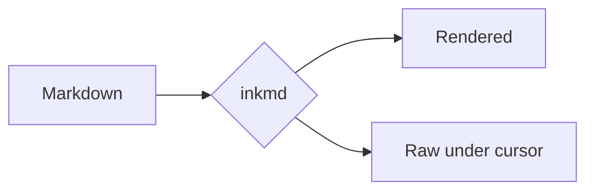
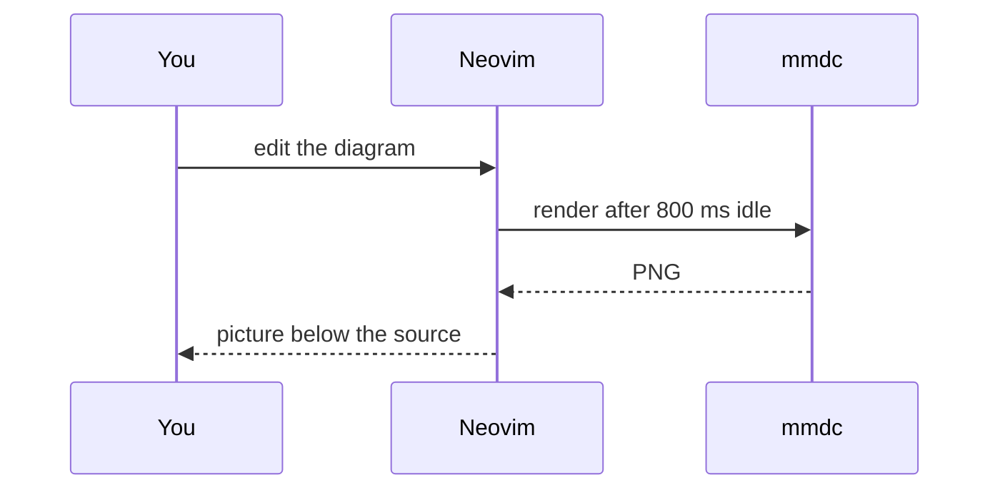

# inkmd demo

Move the cursor around: the block under it shows as raw markdown.
Toggle rendering with `<leader>tm`, or `:Inkmd!` for every buffer.

## Inline text

Text with `inline code`, *emphasis*, **strong**, ~~struck~~ and ==highlight==.
Entities: &copy; &amp; &rarr; &#9731;. Escaped: \*not emphasis\*.
A hidden comment follows <!-- you can't see me --> right here.

## Links

- Web: [Neovim](https://neovim.io)
- GitHub: [inkmd issues](https://github.com/neovim/neovim/issues)
- File: [the README](../README.md)
- Autolinks: <https://example.com> and <someone@example.com>
- Reference: [docs][nvim-docs] and [nvim-docs]
- Wikilinks: [[Project Notes]] and [[project-notes|an alias]]
- Footnote reference[^1] and another[^note]

## Lists

- First level
  - Second level
    - Third level
      - Fourth level
- [ ] An open task
- [x] A finished task

1. Ordered
2. Items

## Quotes and callouts

> A plain quote.
> > With a nested quote.

> [!NOTE]
> Useful information users should know.

> [!TIP]
> Helpful advice for doing things better.

> [!IMPORTANT]
> Key information users need to know.

> [!WARNING] Custom title
> Urgent info that needs immediate attention.

> [!CAUTION]
> Advises about risks or negative outcomes.

## Code

```lua
local function greet(name)
  print('hello ' .. name)
end
```

```python
def greet(name: str) -> None:
    print(f"hello {name}")
```

Mermaid diagrams render as pictures. Put the cursor in one to edit its source with a
live preview below:





A broken diagram shows the error under its source:

```mermaid
flowchart LR
  A --> B -->> C[
```

## Tables

| Element  | Status  |  Count |
|:---------|:-------:|-------:|
| Headings | `done`  |      6 |
| Links    | **yes** |     12 |
| Images   | M3      |      3 |

## Images

A PNG, drawn below its paragraph:


The same banner as SVG (converted with rsvg-convert):


A missing image keeps its alt text: 

---

Setext heading
--------------

[nvim-docs]: https://neovim.io/doc/
[^1]: The first footnote.
[^note]: A named footnote.
