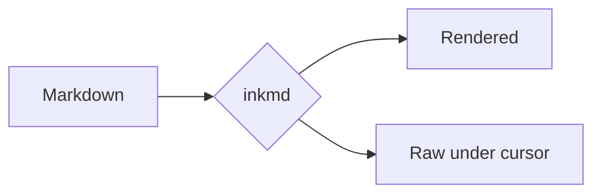
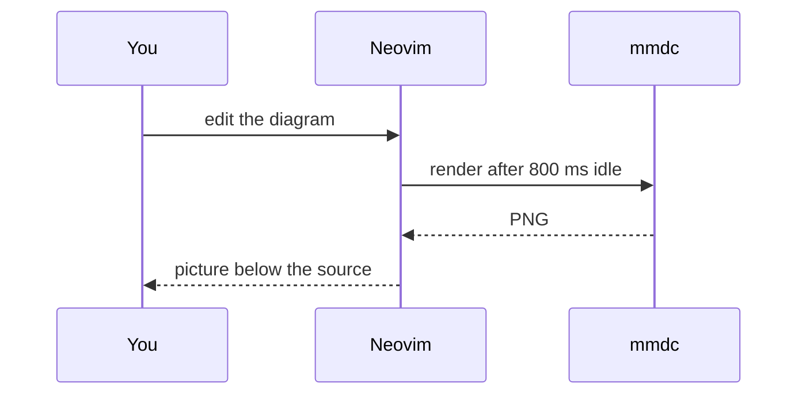

# inkmd demo

Move the cursor around: the block under it shows as raw markdown.
Toggle rendering with `<leader>tm`, or `:Inkmd!` for every buffer.

## Inline text

Text with `inline code`, *emphasis*, **strong**, ~~struck~~ and ==highlight==.
Entities: &copy; &amp; &rarr; &#9731;. Escaped: \*not emphasis\*.
A hidden comment follows <!-- you can't see me --> right here.

## Links

- Web: [Neovim](https://neovim.io)
- GitHub: [inkmd issues](https://github.com/neovim/neovim/issues)
- File: [the README](../README.md)
- Autolinks: <https://example.com> and <someone@example.com>
- Reference: [docs][nvim-docs] and [nvim-docs]
- Wikilinks: [[Project Notes]] and [[project-notes|an alias]]
- Footnote reference[^1] and another[^note]

This paragraph has a [link with a long hidden address](https://github.com/neovim/neovim/issues/14409) in the middle of a line that is longer than most windows are wide, so it shows how inkmd rewraps it by what you actually see.

- A list item with [another long link](https://example.com/a/rather/long/path/to/some/page/that/you/never/see) keeps its hanging indent when it wraps.

## Lists

- First level
  - Second level
    - Third level
      - Fourth level
- [ ] An open task
- [x] A finished task

Custom states, and progress on items with sub-tasks:

- [/] Ship M5 (in progress)
  - [x] Paragraph reflow
  - [x] LaTeX math
  - [/] Checkbox states
  - [ ] Heading borders
  - [-] Something we dropped
- [>] Forwarded to next week
- [!] Important
- [?] A question
- [-] Cancelled

1. [x] Ordered lists take checkboxes too
2. [ ] Like this one

1. Ordered
2. Items

## Quotes and callouts

> A plain quote.
> > With a nested quote.

> [!NOTE]
> Useful information users should know.

> [!TIP]
> Helpful advice for doing things better.

> [!IMPORTANT]
> Key information users need to know.

> [!WARNING] Custom title
> Urgent info that needs immediate attention.

> [!CAUTION]
> Advises about risks or negative outcomes.

## Code

```lua
local function greet(name)
  print('hello ' .. name)
end
```

```python
def greet(name: str) -> None:
    print(f"hello {name}")
```

Mermaid diagrams render as pictures. Put the cursor in one to edit its source
with a live preview below:





A broken diagram shows the error under its source:

```mermaid
flowchart LR
  A --> B -->> C[
```

## Math

Inline math becomes Unicode: Euler's identity $e^{i\pi} + 1 = 0$, a bound
$\alpha^2 \leq \frac{1}{n}$, a sum $\sum_{i=1}^{n} i = \frac{n(n+1)}{2}$ and a map
$f: \mathbb{R}^n \to \mathbb{R}$.

A display formula on its own is typeset with LaTeX and drawn as a picture.
Put the cursor in it to edit the source with a live preview below:

$$
\int_{-\infty}^{\infty} e^{-x^2}\,dx = \sqrt{\pi}
$$

$$
\mathbf{A} = \begin{pmatrix} a_{11} & a_{12} \\ a_{21} & a_{22} \end{pmatrix},
\qquad \det \mathbf{A} = a_{11}a_{22} - a_{12}a_{21}
$$

A broken formula shows the TeX error under its source:

$$
\frac{1}{\undefinedcommand}
$$

## Tables

| Element  | Status  |  Count |
|:---------|:-------:|-------:|
| Headings | `done`  |      6 |
| Links    | **yes** |     12 |
| Images   | M3      |      3 |

A table wider than the window is redrawn to fit, with wrapped cells (resize the
window or `:vsplit` to watch it reflow):

| Option | Type | Default | Description |
|:-------|:----:|--------:|-------------|
| `image.max_width` | integer | 100 | Largest drawing in cells; the height is also capped to the window height minus three. |
| `image.backend` | string | `'auto'` | Detects the terminal; `'kitty'` forces the graphics protocol and `'text'` disables images. |
| `table.block` | string | `'auto'` | Tables wider than the window are drawn fitted to it; `'always'` or `'never'` override that. |
| [docs](https://neovim.io) | **bold** | 3 | Supercalifragilisticexpialidocious words break when a column is too narrow for them. |

## Images

A PNG, drawn below its paragraph:


The same banner as SVG (converted with rsvg-convert):


A missing image keeps its alt text: 

---

Setext heading
--------------

[nvim-docs]: https://neovim.io/doc/
[^1]: The first footnote.
[^note]: A named footnote.
